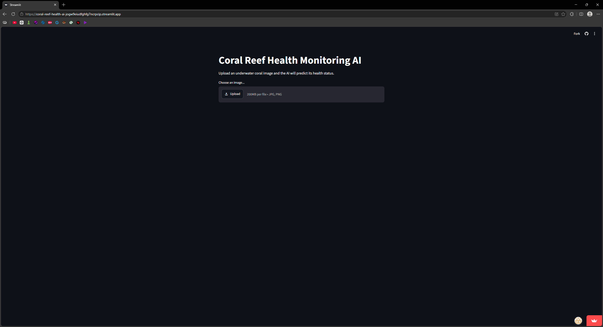
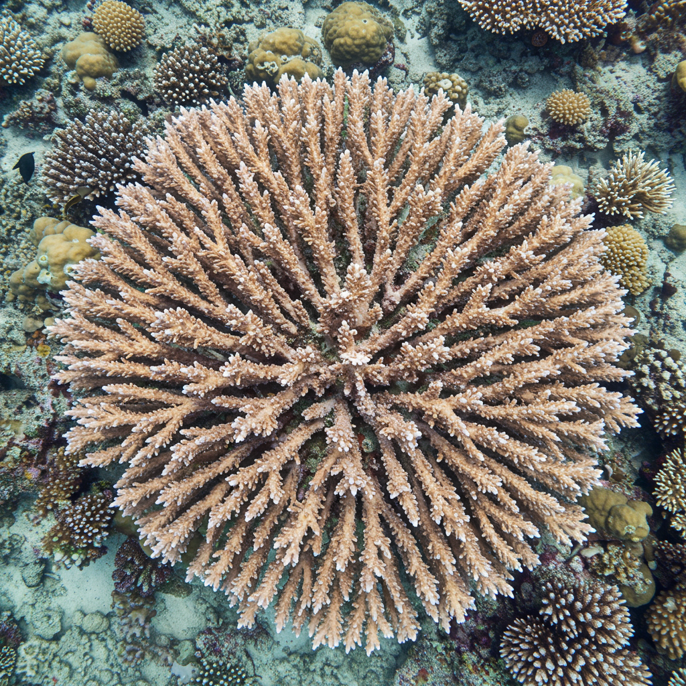
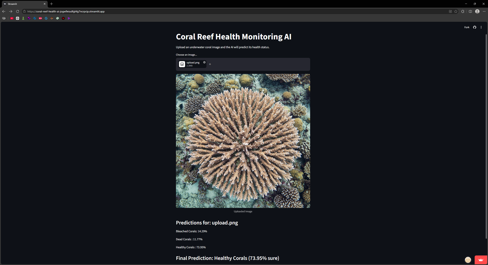
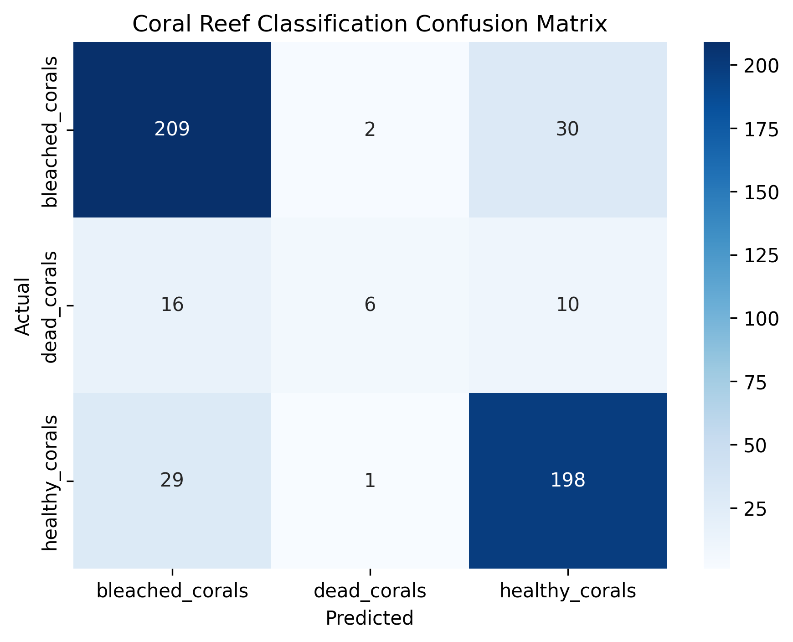

# AI-Powered Coral Reef Health Monitoring System

## Overview

An AI-powered computer vision system designed to monitor coral reef health through automated image classification. The project uses a Convolutional Neural Network (CNN) to classify underwater coral images into three categories:

* Healthy Corals
* Bleached Corals
* Dead Corals

The trained model is deployed using Streamlit, enabling real-time coral health assessment through an interactive web interface.

---

## Features

* Custom CNN architecture built with TensorFlow and Keras
* Classification of coral reef images into three health categories
* Real-time image upload and prediction
* Confidence score generation
* Interactive Streamlit web application
* Automated coral health assessment workflow

---

## Dataset

The model was trained on a dataset containing over 2,500 coral reef images:

| Category        | Images |
| --------------- | ------ |
| Bleached Corals | 1,256  |
| Dead Corals     | 150    |
| Healthy Corals  | 1,150  |

**Total Images:** 2,556

---

## Model Architecture

The CNN architecture consists of:

* Conv2D (32 Filters) + MaxPooling
* Conv2D (64 Filters) + MaxPooling
* Conv2D (128 Filters) + MaxPooling
* Flatten Layer
* Dense Layer (128 Units)
* Dropout (0.3)
* Softmax Output Layer (3 Classes)

**Total Trainable Parameters:** 3.3 Million

---

## Application Screenshots

### Home Screen

The landing page provides an intuitive interface for coral image analysis.

### Image Upload

Users can upload underwater coral reef images for automated health assessment.

### Prediction Example

The application generates class probabilities and predicts whether the coral is Healthy, Bleached, or Dead.

---

## Results

The CNN model was evaluated on a validation set containing 501 coral reef images.

### Classification Performance

| Class          | Precision | Recall | F1-Score |
| -------------- | --------- | ------ | -------- |
| Bleached Coral | 0.82      | 0.87   | 0.84     |
| Dead Coral     | 0.67      | 0.19   | 0.29     |
| Healthy Coral  | 0.83      | 0.87   | 0.85     |

### Overall Metrics

* Accuracy: **82%**
* Weighted Precision: **82%**
* Weighted Recall: **82%**
* Weighted F1-Score: **81%**

The model demonstrated strong performance in identifying healthy and bleached coral reefs. Performance on the dead coral class was comparatively lower due to class imbalance within the dataset.

---

## Confusion Matrix

The confusion matrix visualizes prediction performance across all coral health categories and highlights the impact of dataset imbalance on minority-class detection.

---

## Tech Stack

* Python
* TensorFlow
* Keras
* Streamlit
* NumPy
* Matplotlib
* Seaborn
* Pillow

---

## Live Demo

Launch the deployed application:

https://coral-reef-health-ai-jogw9eiudfghfg7ncrpcip.streamlit.app/

---

## Future Improvements

* Improve minority-class detection using balanced sampling techniques
* Apply transfer learning using EfficientNet and ResNet architectures
* Introduce explainable AI techniques such as Grad-CAM
* Expand the dataset with additional coral health categories
* Deploy a mobile-friendly version for marine researchers

---

## License

This project is provided for educational and portfolio purposes.
